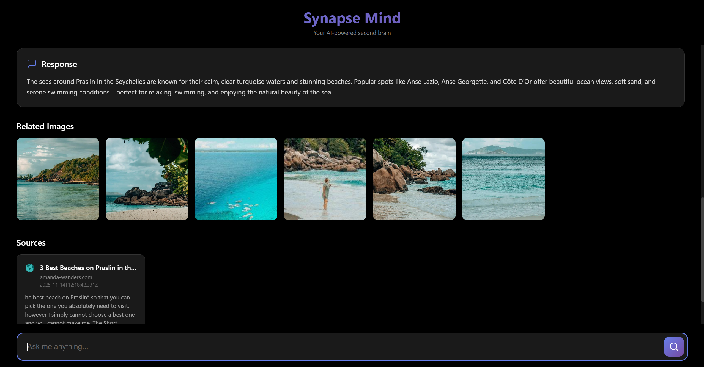
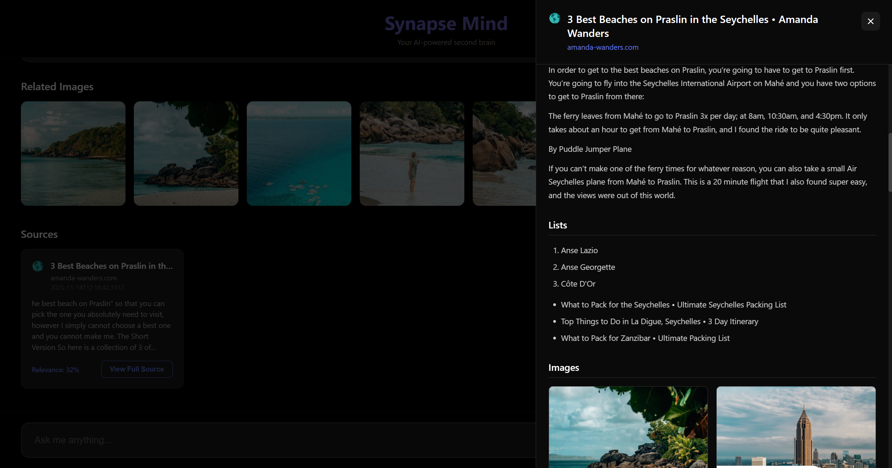

# Synapse Mind

Your AI-powered second brain with seamless capture, smart search, and beautiful visualization.

## Screenshots

### Chat Interface with AI Responses


### Side Panel with Structured Content


---

## Quick Start

### Option 1: Start All Components (Recommended)
```bash
# Double-click this file
start-all.bat
```

### Option 2: Start Individually

**Backend:**
```bash
start-backend.bat
# Or manually:
# cd backend && python main.py
```

**Frontend:**
```bash
start-frontend.bat
# Or manually:
# cd frontend && npm run dev
```

**Extension:**
1. Open Chrome: `chrome://extensions/`
2. Enable "Developer mode"
3. Click "Load unpacked"
4. Select the `extension` folder

---

## What's New

### ✨ Features Implemented

#### 1. React App with Black Background
- Modern, distraction-free interface with pure black background
- Central query textbox for natural language search
- Displays AI-generated responses
- Images lined up horizontally (frameless cards)
- Source cards with relevance scores
- "View Full Source" button for each resource

#### 2. Side Panel (40% Width)
- Slides in from the right when viewing source details
- Displays structured content:
  - **Headings** - Hierarchical display
  - **Paragraphs** - Clean text formatting
  - **Lists** - Ordered and unordered lists
  - **Tables** - Properly formatted with headers
  - **Images** - Grid layout
  - **YouTube Videos** - Embedded player
- Click outside or X button to close

#### 3. Extension with Grey Background
- Changed from purple/bluish gradient to professional grey
- "Capture This Page" - Saves content to backend
- "Open Synapse Mind" - Opens React app in new tab

#### 4. Background Task Processing (FastAPI)
- `/save` endpoint returns **immediately** with success response
- Processing happens asynchronously in background:
  - Text chunking
  - Embedding generation
  - Image downloads
  - Image embedding
- **Parallel image processing** for better performance
- All content/images processed concurrently

---

## Usage Example

### 1. Capture Content
```
1. Visit any webpage (e.g., travel blog about beaches)
2. Click Synapse extension icon
3. Click "Capture This Page"
4. See: "Content received and queued for processing"
   (Processing happens in background)
```

### 2. Query Your Knowledge
```
1. Click "Open Synapse Mind" (or go to http://localhost:3000)
2. Type: "where is best beach I can visit"
3. Press Enter
4. See:
   - AI response with recommendations
   - Related beach images (horizontal scroll)
   - Source cards showing original articles
```

### 3. View Source Details
```
1. Click "View Full Source" on any card
2. Side panel opens (40% width)
3. See structured content:
   - Article headings
   - Paragraphs and lists
   - Tables with beach comparisons
   - Images from the article
   - Embedded YouTube videos (if any)
4. Click outside to close
```

---

## API Response Structure

### Query Response
```json
{
  "response": "Based on your saved content, here are some great beaches...",
  "images": [
    "/images/uuid/beach1.jpg",
    "/images/uuid/beach2.jpg"
  ],
  "sources": [
    {
      "document_id": "uuid-123",
      "url": "https://example.com/best-beaches",
      "title": "Top 10 Beaches in the World",
      "domain": "example.com",
      "favicon": "https://example.com/favicon.ico",
      "timestamp": "Monday afternoon, 02:30 PM",
      "snippet": "Discover the most beautiful beaches...",
      "relevance_score": 0.92,
      "structured_content": {
        "headings": [...],
        "paragraphs": [...],
        "lists": [...],
        "tables": [...],
        "images": [...]
      },
      "youtube_videos": [
        {
          "video_id": "abc123",
          "embed_url": "https://youtube.com/embed/abc123",
          "title": "Beach Tour 2024"
        }
      ]
    }
  ]
}
```

---

## Architecture

### Backend (FastAPI)
- **Endpoint**: `http://localhost:8000`
- **Background Tasks**: Async processing with `BackgroundTasks`
- **Parallel Processing**: `asyncio.gather()` for concurrent image downloads
- **Vector DB**: ChromaDB for persistent embeddings
- **Search**: Hybrid BM25 + Semantic with RRF fusion
- **Embeddings**: SigLIP (text + images in same vector space)

### Frontend (React + Vite)
- **URL**: `http://localhost:3000`
- **Styling**: Pure CSS with black background
- **State**: React hooks (useState)
- **HTTP**: Axios for API calls
- **Layout**: Flexbox with 60/40 split when panel open

### Extension (Chrome)
- **Popup**: Grey background with modern design
- **Content Script**: Extracts structured data from pages
- **Integration**: Opens React app via `chrome.tabs.create()`

---

## File Structure

```
appointy/
├── backend/
│   ├── main.py                 # FastAPI with background tasks
│   ├── siglip_embeddings.py    # SigLIP embedding model
│   └── image_utils.py          # Image handling utilities
├── frontend/
│   ├── src/
│   │   ├── App.jsx            # Main React component
│   │   ├── App.css            # Black background styling
│   │   ├── main.jsx           # Entry point
│   │   └── index.css          # Global styles
│   ├── package.json
│   └── vite.config.js
├── extension/
│   ├── manifest.json
│   ├── popup.html             # Extension popup
│   ├── popup.css              # Grey background
│   └── popup.js               # Opens React app
├── start-all.bat              # Start all components
├── start-backend.bat          # Start backend only
├── start-frontend.bat         # Start frontend only
├── SETUP_GUIDE.md             # Detailed setup instructions
└── README.md                  # This file
```

---

## Technologies

- **Backend**: FastAPI, ChromaDB, SigLIP, OpenAI GPT-4.1, BM25, asyncio
- **Frontend**: React 18, Vite, Axios
- **Extension**: JavaScript, Chrome Extension APIs
- **Styling**: Modern CSS with gradients, animations, flexbox

---

## Key Improvements

1. ✅ **Background Processing**: No waiting for embeddings
2. ✅ **Parallel Image Processing**: All images processed concurrently
3. ✅ **Black Background UI**: Clean, modern interface
4. ✅ **Grey Extension**: Professional design
5. ✅ **Side Panel**: 40% width, structured content display
6. ✅ **YouTube Embeds**: Play videos directly in panel
7. ✅ **Frameless Images**: Horizontal scroll layout
8. ✅ **One-Click Open**: Extension opens React app directly

---

## Troubleshooting

**Backend won't start?**
- Check if port 8000 is available
- Activate virtual environment: `synapsenv\Scripts\activate`

**Frontend shows errors?**
- Ensure backend is running
- Check `http://localhost:8000` in browser

**Extension not capturing?**
- Check Console in DevTools (F12)
- Reload extension in `chrome://extensions/`

**Images not showing?**
- Verify backend is serving images
- Check `./images/` directory exists

---

## Development Commands

```bash
# Backend
cd backend
python main.py

# Frontend
cd frontend
npm run dev          # Development
npm run build        # Production build
npm run preview      # Preview production

# Check API
curl http://localhost:8000
curl http://localhost:8000/stats
```

---

For detailed setup instructions, see [SETUP_GUIDE.md](SETUP_GUIDE.md)

---

**Built with ❤️ using FastAPI, React, and Chrome Extensions**
